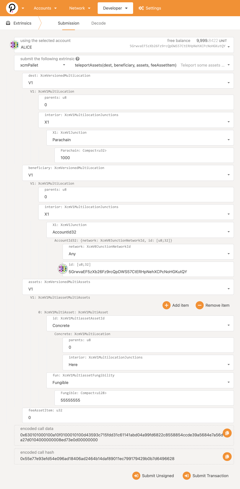

# Teleporting assets

You can perform a teleport operation via extrinsics menu.

Here's an example:

Some comments:
- `dest` - Specify XCM multilocation to the target parachain (chain id 1000, in our case)
- `beneficiary` - XCM multilocation designating the account id on targe parachain
- `assets` - Concrete, fungible, "Here" will yield the default token of relay chain (WND)
- `feeAssetItem` - Index of asset we wish to pay fee in; leave 0 for the WND asset
